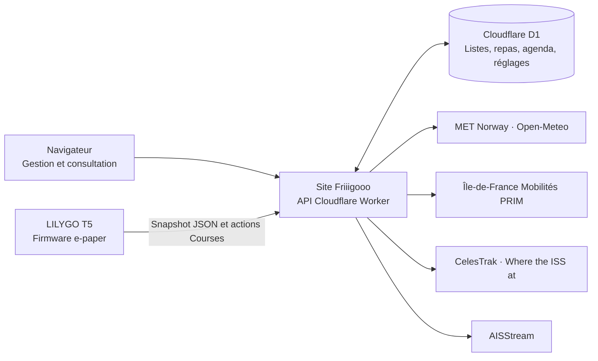

<div align="center">

# Friiigooo

### Le tableau de bord de la famille, sur le frigo.

Les courses, les repas et les rendez-vous au même endroit.<br />
La météo, les prochains départs et un petit regard vers l’espace.

**Une application web · Un écran e-paper tactile · Des données partagées**

[Ouvrir le site](https://liste-frigo.pliskain.chatgpt.site) · [Firmware e-paper](https://github.com/broduoliviercontact-web/liste-frigo/tree/firmware/liste-frigo-epaper) · [Installation](#démarrer-en-local) · [Tests](#tester-le-projet)

</div>

---

## Un écran utile au quotidien

**Friiigooo** est un tableau de bord familial conçu pour un **LILYGO T5 e-paper de 4,7 pouces**, installé en portrait sur le réfrigérateur. Le navigateur permet de préparer et modifier les informations ; l’écran les rend accessibles à toute la famille, avec une navigation tactile.

L’interface privilégie le contraste, les grandes zones tactiles et une mise en page **540 × 960** adaptée au papier électronique. Les noms `SUPERVIE` et `supervie` subsistent dans le code, les variables et certains libellés : ils désignent le même projet.

> Le site publié est protégé par un code d’accès familial. Le code de démonstration local indiqué plus bas ne donne pas accès à la production.

## Neuf onglets, un seul tableau de bord

| Onglet | Ce qu’on y trouve |
| --- | --- |
| **🛒 Courses** | Plusieurs listes partagées, ajout de plusieurs articles à la fois, coches et nettoyage des articles achetés. |
| **🧸 Crèche** | Préparation du départ et du retour, avec les prévisions météo. La liste de vêtements du firmware est fixe et signalée comme telle. |
| **🌤 Météo** | Conditions actuelles à Pantin, températures du jour, douze heures de prévisions et aperçu du lendemain. |
| **🍽 Repas** | Planning hebdomadaire, déjeuner et dîner, modifiable depuis le web. |
| **🚇 Métro** | Prochains passages autour de Raymond Queneau : métro **5**, bus **145**, **147** et **318**, selon la disponibilité du fournisseur. |
| **📅 Agenda** | Événements persistants : date, heure, catégorie et durée, avec une vue adaptée à l’e-paper. |
| **🛰 ISS** | Position calculée de la Station spatiale internationale et trajectoires passée et future sur une carte du monde. |
| **✈️ Air** | **Simulation** de trafic aérien pour le radar — ce n’est pas une source ADS-B réelle. |
| **⛴ Bateaux** | Carte live MyShipTracking du canal et signaux AIS structurés quand la source serveur les reçoit, avec distance, direction et estimation d’arrivée quand les données le permettent. |

Les **réglages** permettent de choisir les onglets visibles, la préférence de démarrage et le carrousel. Ils sont enregistrés côté serveur et partagés entre les navigateurs.

### Web et écran : qui pilote quoi ?

- Choisir un onglet sur le web change la vue du navigateur et la préférence de **prochain démarrage** de l’écran.
- L’écran déjà allumé conserve sa navigation tactile et son carrousel.
- Si son onglet actif devient masqué dans les réglages, il passe à un onglet visible.
- Deux modifications concurrentes des réglages sont contrôlées par révision : une écriture obsolète est refusée, plutôt que d’écraser silencieusement la précédente.

## Architecture



Le site est à la fois l’application web et le serveur de l’écran. Le firmware consomme le snapshot **`/api/epaper/v1/state`** ; il ne se connecte pas directement à AISStream et ne contient pas sa clé.

| Couche | Technologies |
| --- | --- |
| Interface | React 19, TypeScript, CSS, conventions App Router |
| Développement et compilation | Vinext, Vite |
| Serveur et hébergement | Cloudflare Workers, ChatGPT Sites |
| Persistance | Cloudflare D1, Drizzle et migrations SQL |
| Calcul orbital | `satellite.js` |
| Validation | Node Test Runner, Playwright, Wrangler/Miniflare |
| Firmware, dans sa branche dédiée | Arduino/C++, PlatformIO, environnement `T5-ePaper-S3` |

## Deux branches, deux projets

| Branche GitHub | Contenu |
| --- | --- |
| [`main`](https://github.com/broduoliviercontact-web/liste-frigo/tree/main) | Application web, API, migrations et tests du site. **Ce README décrit cette branche.** |
| [`firmware/liste-frigo-epaper`](https://github.com/broduoliviercontact-web/liste-frigo/tree/firmware/liste-frigo-epaper) | Firmware, SDK LilyGo, instructions matérielles et contrat e-paper. |

> **Ne pas fusionner la branche firmware dans `main`.** Les deux branches ont des historiques Git distincts. Utiliser deux répertoires de travail séparés.

Documentation côté écran :

- [Prise en main et consignes firmware](https://github.com/broduoliviercontact-web/liste-frigo/blob/firmware/liste-frigo-epaper/examples/liste_frigo/AI_HANDOFF.md)
- [Contrat de l’API e-paper](https://github.com/broduoliviercontact-web/liste-frigo/blob/firmware/liste-frigo-epaper/examples/liste_frigo/EPAPER_API_CONTRACT.md)
- [Boîtier magnétique](https://github.com/broduoliviercontact-web/liste-frigo/tree/firmware/liste-frigo-epaper/shell/fridge-magnetic-case)

## Démarrer en local

### Prérequis

- **Node.js 22.13 ou supérieur**, avec npm.
- Git.
- Chromium pour les tests navigateur, installé avec Playwright ci-dessous.

```bash
git clone --branch main --single-branch https://github.com/broduoliviercontact-web/liste-frigo.git
cd liste-frigo
npm ci
cp .env.example .dev.vars
npm run dev:local
```

Ouvrir l’adresse affichée par Vite dans le terminal. Le code d’accès du mode local est **`supervie`**.

`dev:local` applique les migrations à une **base D1 locale**, puis lance Vite/Miniflare. Les réglages de développement utilisent des sources contrôlées : certaines pages externes sont indisponibles et les bateaux peuvent être simulés. Ces valeurs ne sont pas intégrées à l’artefact de production.

**Utiliser le runtime Cloudflare local.** `npm start` / `vinext start` sous Node seul ne fournit pas les bindings `cloudflare:workers` et D1 nécessaires aux API. Ne pas lancer non plus `worker/index.ts` directement avec Wrangler avant compilation : il dépend de modules virtuels Vinext.

### Configuration

Les variables sensibles vont dans **`.dev.vars` en local** et dans les secrets de l’hébergement en production. Ne jamais les placer dans le README, les sources ou une capture de logs.

| Variable | Usage |
| --- | --- |
| `SUPERVIE_ACCESS_CODE` | Code partagé utilisé pour l’accès familial et l’authentification du firmware. |
| `IDFM_PRIM_API_KEY` | Accès aux prochains passages Île-de-France Mobilités. |
| `AISSTREAM_API_KEY` | Accès au flux AIS des bateaux, exclusivement côté serveur. |
| `BOATS_USE_MOCK` | Active les bateaux simulés pour le développement. |
| `SUPERVIE_LOCAL_MOCKS` | Active les réponses e-paper contrôlées du mode local. |

Le mode local est défini dans [vite.config.ts](vite.config.ts). Pour tester les fournisseurs réels, adapter explicitement cette configuration et les secrets ; renseigner une clé ne désactive pas à lui seul tous les mocks.

## Des actions Courses qui résistent aux coupures

Une action est enregistrée dans le navigateur **avant** son premier envoi. Si la réponse est perdue, elle peut être reprise avec sa clé initiale, y compris après rechargement.

- **Côté serveur :** clé, écriture et résultat métier sont réunis dans un batch D1 atomique. Dans la fenêtre de conservation, rejouer une clé avec le même contenu ne répète pas l’écriture ; un contenu différent produit un conflit.
- **Entre onglets :** Web Locks protège le journal partagé et coordonne les reprises.
- **Session expirée :** retour au formulaire, puis reprise après reconnexion.
- **Limitation `429` :** respect de `Retry-After`, avec au maximum trois reprises automatiques après l’envoi initial.
- **Refus métier :** raison visible et absence de reprise automatique.
- **Après 24 h :** une action expirée est conservée comme résultat inconnu, à vérifier avant de la refaire.

La garantie suppose un stockage navigateur fonctionnel et Web Locks. Si ces fonctions manquent, les mutations sont bloquées explicitement. Effacer manuellement le stockage supprime aussi le journal de reprise.

**Capacité : 40 listes et 200 articles par liste**, contrôlée sous concurrence. Un import qui dépasse la place disponible est refusé sans insertion partielle.

## Des données fraîches, ou un état explicite

| Source | Comportement |
| --- | --- |
| **Métro** | Un snapshot de plus de 20 minutes n’est pas une donnée courante. Les passages périmés sont filtrés ; l’e-paper ne transforme pas un délai négatif en faux départ « À quai ». |
| **ISS** | CelesTrak est prioritaire ; [Where the ISS at](https://wheretheiss.at/w/developer) sert de secours. Les éléments orbitaux de plus de 48 h sont refusés. La position reste un calcul orbital, pas une mesure GPS en direct. |
| **Météo** | Prévisions MET Norway et conditions Open-Meteo, avec repli et temporisation après limitation fournisseur. |
| **Bateaux** | La carte MyShipTracking peut montrer des bateaux même quand AISStream ne renvoie aucune position structurée pour l’e-paper. « Aucun bateau » dans notre API ne garantit pas l’absence de bateau sur le canal. |
| **Snapshot e-paper** | Les sources sont agrégées avec des délais bornés : une panne externe ne doit pas rendre toutes les pages indisponibles. |

Les caches mémoire et certaines temporisations sont propres à chaque Worker. Ils ne constituent pas une coordination mondiale des quotas fournisseurs. La collecte AIS n’est pas garantie permanente ; une telle évolution demanderait une architecture dédiée.

## Accès et sécurité

Une connexion réussie crée une session aléatoire de **256 bits**, valable **30 jours**, dans un cookie `HttpOnly`, `SameSite=Strict` et `Secure` en HTTPS. D1 conserve son empreinte liée au code configuré ; changer ce code invalide les sessions existantes. Les anciens cookies contenant le code sont convertis au contrôle d’accès du navigateur.

Les vérifications du code partagé sont limitées par D1 à **120 par fenêtre fixe d’une minute**, tous clients confondus. Les sessions navigateur déjà établies ne consomment pas ce quota.

**Limite connue :** son épuisement peut encore retarder une nouvelle connexion ou une requête du firmware qui utilise directement le code. Aucune règle WAF par IP n’est déclarée active dans ce dépôt.

Ce projet utilise un accès familial partagé, sans comptes individuels ni rôles par personne.

## Tester le projet

```bash
npm run lint
npx tsc --noEmit --incremental false
npm test
npm run test:idempotency
npm run test:reliability
```

`npm test` inclut la compilation de production. Les suites d’intégration démarrent un Worker avec une base D1 locale jetable et appliquent les migrations.

Pour les parcours navigateur :

```bash
npx playwright install chromium
npm run test:browser:lost-response
npm run test:browser:reauth
npm run test:browser:rejected
npm run test:browser:rate-limit-seconds
npm run test:browser:rate-limit-additional
npm run test:browser:multi-tab
npm run test:browser:journal-limits
npm run test:browser:settings-keyboard
```

**Exécuter ces suites successivement**, car elles reconstruisent le même répertoire `dist/`. Elles couvrent notamment la perte de réponse après écriture, la reprise après rechargement, deux onglets, les refus métier, les délais de reprise, le stockage indisponible et le clavier dans les dialogues de listes.

Les tests navigateur utilisent Chromium. Une compilation firmware ou un test automatisé ne remplace pas les essais physiques : tactile, rendu e-paper, coupure Wi-Fi et redémarrage pendant une opération.

## Repères dans le code

```text
app/
  page.tsx                      Interface et onglets
  access.ts                     Sessions et authentification
  access-limit.ts               Limiteur partagé D1
  pending-list-mutations.ts     Journal durable du navigateur
  client-mutation-queue.ts      Sérialisation des actions
  api/
    lists/                      Listes et articles
    meals/                      Planning des repas
    agenda/                     Événements persistants
    epaper-settings/            Réglages partagés et révisions
    transit/                    PRIM, cache et fraîcheur
    iss/                        Éléments orbitaux et trajectoires
    boats/                      API des bateaux
    epaper/v1/                  Agrégation et météo
    version/                    Identifiant de version du site
db/schema.ts                    Schéma Drizzle
drizzle/                        Migrations SQL et métadonnées
tests/                          Tests unitaires, HTTP/D1 et navigateur
server/services/aisService.ts    Collecte et calculs AIS
public/                         Images et ressources statiques
worker/index.ts                 Entrée Cloudflare Worker
.openai/hosting.json             Identité et bindings du site existant
```

### API principale

Les routes applicatives sont authentifiées. Le firmware utilise l’en-tête `x-supervie-access-code` ; le navigateur utilise sa session.

| Route | Rôle |
| --- | --- |
| `GET / POST /api/access` | Vérification de session et connexion. |
| `GET / POST /api/lists` | Lecture et mutations Courses. |
| `GET / POST /api/meals` | Planning hebdomadaire des repas. |
| `GET / POST /api/agenda` | Agenda et disposition. |
| `GET / POST /api/epaper-settings` | Réglages ; les écritures exigent une `revision`. |
| `GET /api/transit` | Départs des transports. |
| `GET /api/iss` | Position et trajectoires orbitales. |
| `GET /api/air` | Trafic aérien simulé. |
| `GET /api/boats` | Bateaux AIS et état de collecte. |
| `GET /api/epaper/v1/state?listId=<id>` | Snapshot consommé par l’écran. |
| `GET /api/version` | Diagnostic de version du site. |

Les mutations Courses utilisent l’en-tête **`x-supervie-mutation-id`**. Actions disponibles : `createList`, `renameList`, `deleteList`, `addItem`, `addItems`, `toggleItem`, `deleteItem`, `clearChecked`.

## Base de données et publication

D1 est exposé sous le binding **`DB`**. Les migrations versionnent les listes, articles, repas, événements, réglages, snapshots transit, clés d’idempotence, compteurs d’accès et sessions.

Pour faire évoluer le schéma :

```bash
npm run db:generate
npm run db:migrate:local
npm run build
```

- Générer une **migration additive** ; ne pas réécrire les migrations historiques déjà appliquées.
- Tester une base locale vide et la conservation des données existantes.
- Sur une ancienne base contenant déjà `agenda_events` sans migration `0002` enregistrée, inspecter schéma et historique avant toute intervention. Ne pas marquer cette migration comme appliquée aveuglément.
- Le site existant est publié via **ChatGPT Sites** : conserver son identité dans `.openai/hosting.json`. Un clone destiné à une autre instance doit être enregistré avec sa propre identité d’hébergement.
- La publication utilise l’artefact Worker construit et ses migrations. **Un push GitHub seul ne publie pas le site.**
- Publier le site et flasher le firmware sont deux opérations distinctes.

## Contribuer

Pour un bug, préciser l’onglet, le comportement attendu, ce qui s’affiche réellement et si le problème concerne le web, l’écran ou les deux. Ajouter une reproduction et, si utile, une capture sans code d’accès ni données privées.

Pour une modification :

1. Travailler dans la branche et le répertoire du composant concerné.
2. Préserver le contrat JSON consommé par l’écran.
3. Ajouter un test qui reproduit le défaut lorsqu’il s’y prête.
4. Vérifier les tests concernés et documenter les limites restantes.

Les prochaines améliorations possibles concernent notamment la protection d’accès par IP, la coordination des quotas externes, la compatibilité avec d’autres navigateurs et le découpage de l’interface principale en composants plus petits.

---

<div align="center">

**Friiigooo — les informations de la maison, à portée de main.**

</div>


### Quotas des transports

La collecte PRIM est réservée atomiquement dans D1, via la clé technique
`transit_provider_refresh` de `app_settings`. Les nouvelles instances Worker
partagent cette réservation et la date de reprise après une erreur ; une panne
ne rajeunit pas le dernier snapshot réussi. Huit requêtes au maximum sont
échelonnées par collecte, espacée d’au moins une minute (au plus 11 520 appels
par 24 h pour cette application, hors autres utilisateurs de la même clé).
Un `Retry-After` plus long est respecté. Les passages expirés restent masqués
pendant l’attente. Le propriétaire a confirmé un quota de 1 000 000 de requêtes
par jour le 12 septembre 2026. Pour une autre instance, adapter la cadence au
quota réel avant publication. La migration 0009 libère une seule fois la
temporisation de l’ancien quota épuisé ; les nouveaux Retry-After restent respectés.

PRIM documente notamment des plafonds de 5 requêtes/seconde et 1 000/jour pour
certains comptes : vérifier le quota réel dans « Ma consommation API ».
Source : https://prim.iledefrance-mobilites.fr/en/apis/idfm-ivtr-requete_unitaire
