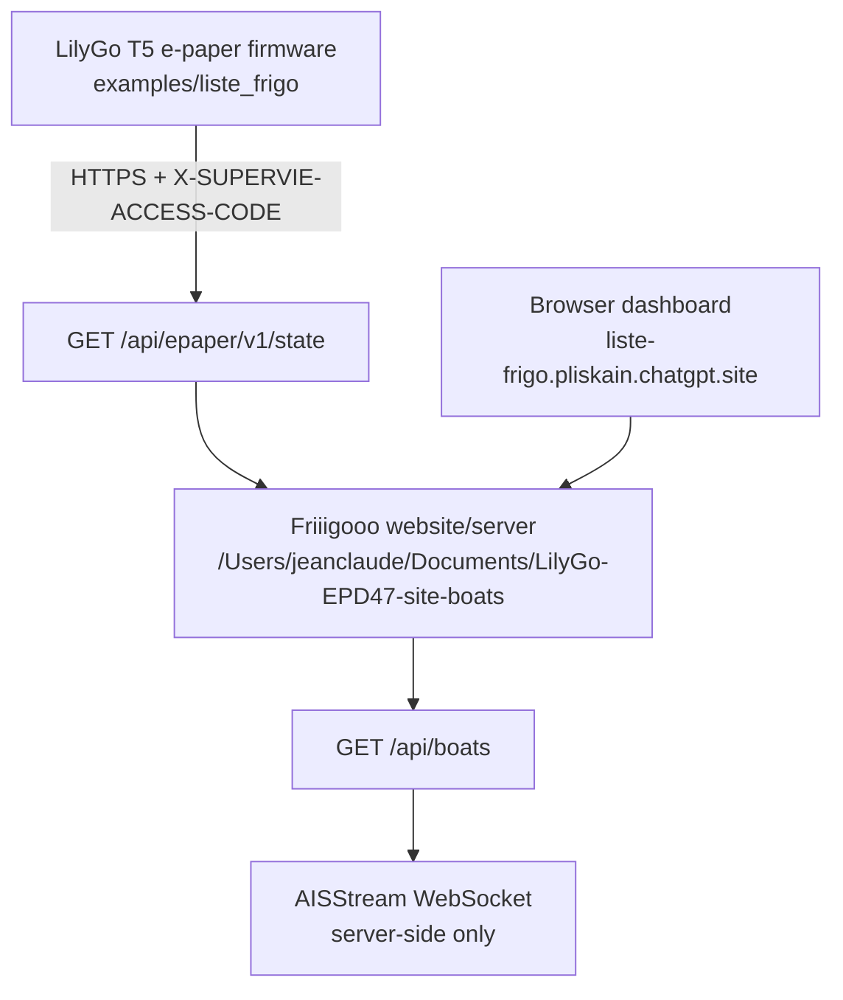

# Friiigooo E-paper Agent Handoff

Friiigooo is a family dashboard for a LilyGo T5 4.7 inch e-paper screen. The
firmware in this directory renders shopping lists, creche weather, weather,
meals, metro, agenda, ISS, air traffic, and boats.

## Current topology



The firmware talks only to `GET /api/epaper/v1/state`. The AISStream API key is
owned by the website/server and must never be embedded in firmware or browser
code.

## Firmware facts

- Main sketch: `liste_frigo.ino`
- API client: `ListeFrigoApi.cpp` / `ListeFrigoApi.h`
- Rendering: `ListeFrigoDisplay.cpp` / `ListeFrigoDisplay.h`
- Touch navigation: `ListeFrigoTouch.cpp` / `ListeFrigoTouch.h`
- Shared structs and tab IDs: `ListeFrigoTypes.h`
- API contract: `EPAPER_API_CONTRACT.md`
- Local credentials template: `secrets.example.h`

Jean-Claude's active device uses the PlatformIO default environment:

```sh
/Users/jeanclaude/.platformio/penv/bin/pio run -e T5-ePaper-S3
```

USB upload, when the board is connected:

```sh
/Users/jeanclaude/.platformio/penv/bin/pio run -e T5-ePaper-S3 -t upload --upload-port /dev/cu.usbmodem2201
```

Serial monitor:

```sh
/Users/jeanclaude/.platformio/penv/bin/pio device monitor --port /dev/cu.usbmodem2201 --baud 115200
```

OTA upload exists through `T5-ePaper-S3-OTA`, but requires the local
`SUPERVIE_OTA_PASSWORD` environment variable. Do not ask the user to paste the
value into chat.

## Tabs

There are 10 logical tab IDs. Only 9 are visible in the bottom navigation; the
settings tab is internal.

Visible order used by the site today:

1. `listes`
2. `creche`
3. `meteo`
4. `repas`
5. `metro`
6. `agenda`
7. `iss`
8. `air`
9. `bateaux`

Key constants:

- `NAV_TAB_COUNT = 10`
- `NAV_VISIBLE_TAB_MAX = 9`
- `TAB_BOATS = 9`

## Boats behavior

The boats page receives `pages.bateaux` from `/api/epaper/v1/state`.

Expected fields:

- `status`: `ok` or `degraded`
- `updatedAt`: ISO timestamp
- `boats`: up to five entries
- each boat: `name`, `distanceKm`, `speedKmh`, `direction`, `etaMinutes`,
  `updatedAt`
- optional route metadata from the server may include canal/city context, but
  the current firmware has a static empty-state canal map for La Villette,
  Pantin, Raymond Queneau, Bobigny, and Bondy.

Important display rule: even when `boats` is empty, the e-paper boats tab should
still render the canal visualization and city markers. A boat-free result is a
normal live state, not an error.

When boats are present, the nearest boat is featured as the next passage. The
firmware only redraws the boats page when the boats state changes and the boats
tab is active.

## Website/server facts

The companion website checkout is:

```sh
cd /Users/jeanclaude/Documents/LilyGo-EPD47-site-boats
```

Production URL:

```text
https://liste-frigo.pliskain.chatgpt.site
```

Relevant production endpoints:

- `GET /api/boats`
- `GET /api/epaper/v1/state`

Local website development:

```sh
npm run dev
```

For local AIS tests, `.dev.vars` may contain:

```text
BOATS_USE_MOCK=true
```

Set it to `false` only when using a valid local `AISSTREAM_API_KEY`. Do not
commit `.dev.vars` or reveal its contents.

## Safe workflow

Before editing:

```sh
git status --short --branch
```

Build firmware after C++ changes:

```sh
/Users/jeanclaude/.platformio/penv/bin/pio run -e T5-ePaper-S3
```

If changing the website, run its tests/build in the website checkout and keep
the `/api/epaper/v1/state` contract compatible with this firmware.

Do not revert unrelated deletions or local files unless Jean-Claude explicitly
asks. Keep commits focused on Friiigooo files.
